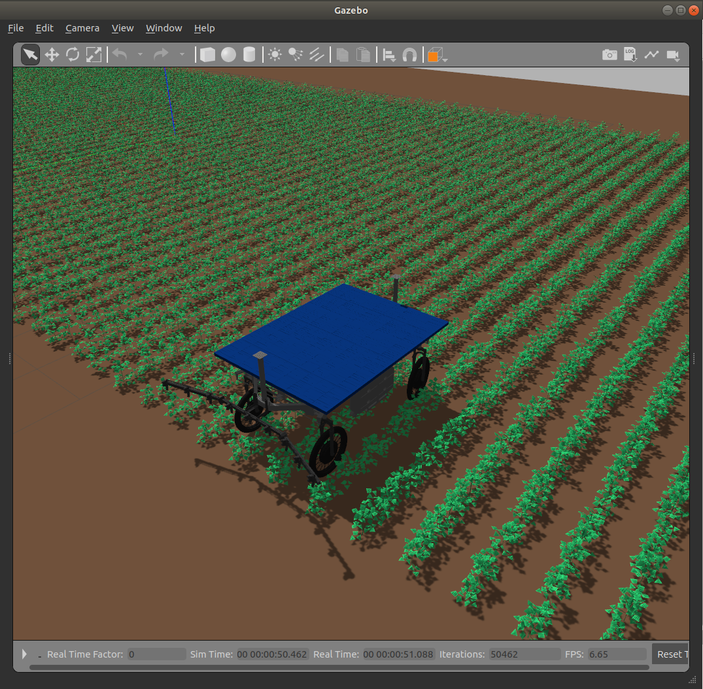

# weed_robot_navigation

Navegación del robot desmalezador.

El script [bin/weed_robot.sh](bin/weed_robot.sh) se utiliza para levantar todos los componentes necesarios para la simulación del robot desmalezador y la ejecución de la navegación. Recibe los siguientes parámetros
* -w, --world WORLD_NAME: nombre del archivo SDF que describe el escenario de simulación en Gazebo ubicado en *weed_robot_gazebo/worlds*.
* -m, --map MAP_NAME: nombre de la imagen PGM con el mapa del entorno ubicado en *weed_robot_navigation/maps*.
* -p, --pose POSE: posición y orientación donde se ubicará al robot al inicio, ejemplo *"-x -4.16 -y 1.0 -Y 1.5708"*.
* -g, --gui: si se desea levantar la interfaz visual de Gazebo.
* -v, --visualization: si se desea levantar el visualizador RViz.
* -s, --sensor: si se ejecuta la generación de nube de puntos para el mapa local, caso contrario se usa el mapa estático.
* -n, --navigation: si se quiere ejecutar la navegación, caso contrario solo se muestra el robot.
* -t, --tracks TRACK_SEQUENCE: secuencia de franjas a recorrer, ejemplo *"[2,4,1,3]"*.
* -l, --last POSITION: posición en y de la generación del último waypoint.
* -p, --omega: para generar giros del tipo Omega en lugar de T.
* -b, --bottom: si el robot inicia la primer franja desde abajo, caso contrario la iniciará desde arriba.

Ejemplos:

```
$ ./bin/weed_robot.sh -w obstacles -m obstacles -p "-x 0.0 -y 0.0 -Y 0.0" -g -v
```

```
$ ./bin/weed_robot.sh -w field -m field -p "-x -14.56 -y 1.0 -Y 1.5708" -g -v -s -n -t "[3, 4]" -l "-10.0"
```
```
$ ./bin/weed_robot.sh -w field_plants -m field -p "-x -14.56 -y 1.0 -Y 1.5708" -g -v -s -n -t "[3, 4]" -l "-10.0"
```



En la carpeta [test](test) se encuentran los scripts python utilizados para los experimentos de giros y recorridos.

